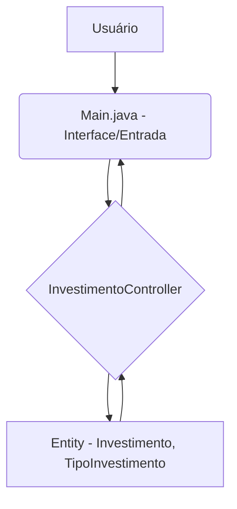
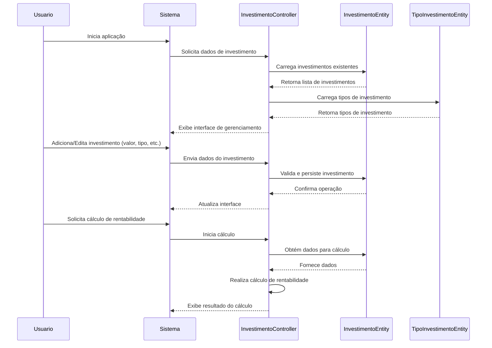

# InvestimentoJava: Sistema de Gerenciamento de Investimentos


Este repositório contém o projeto **InvestimentoJava**, uma aplicação desenvolvida em **Java** com o auxílio do **Apache Maven**, destinada ao gerenciamento e controle de investimentos. O sistema oferece uma plataforma para registrar diferentes tipos de aplicações financeiras, acompanhar seus valores e calcular a rentabilidade, proporcionando uma ferramenta robusta para a gestão de portfólios.

## Visão Geral do Projeto

O InvestimentoJava é concebido para auxiliar usuários na organização de seus ativos financeiros. A aplicação permite a categorização de investimentos por tipo, o registro de valores iniciais e a simulação de rentabilidade. Sua arquitetura modular e a utilização de padrões de projeto visam garantir escalabilidade e facilidade de manutenção, tornando-o uma base sólida para futuras expansões em funcionalidades financeiras.

## Funcionalidades Implementadas

O sistema InvestimentoJava oferece as seguintes funcionalidades:

| Funcionalidade | Descrição Detalhada |
| :--- | :--- |
| **Registro de Investimentos** | Permite o cadastro de novos investimentos, incluindo informações como valor inicial, tipo de investimento e data de aplicação. |
| **Classificação por Tipo** | Os investimentos são categorizados por tipos predefinidos (e.g., Renda Fixa, Ações), facilitando a organização e análise do portfólio. |
| **Cálculo de Rentabilidade** | O sistema é capaz de calcular a rentabilidade dos investimentos, fornecendo métricas essenciais para a avaliação de desempenho. |
| **Gerenciamento de Portfólio** | Oferece uma visão consolidada dos investimentos, permitindo ao usuário acompanhar o desempenho geral de seu portfólio. |
| **Interface de Usuário** | A aplicação inclui uma interface para interação, permitindo a entrada de dados e a visualização dos resultados de forma intuitiva. |

## Arquitetura do Sistema

A arquitetura do InvestimentoJava é estruturada para promover a clareza e a manutenibilidade do código. O diagrama a seguir ilustra os principais componentes e suas interações:



### Tecnologias Empregadas

O projeto foi desenvolvido utilizando as seguintes tecnologias:

*   **Java**: Linguagem de programação principal, versão 8 ou superior.
*   **Apache Maven**: Ferramenta para automação de build e gerenciamento de dependências.

### Estrutura de Pacotes

A organização do código-fonte segue uma estrutura de pacotes lógica, aderindo aos princípios de design de software:

*   `br.com.ControleInvestimento`: Contém a classe `Main.java`, que serve como ponto de entrada da aplicação.
*   `br.com.ControleInvestimento.modal.entity`: Define as classes de modelo de dados, como `Investimento.java` e `TipoInvestimento.java`.
*   `br.com.ControleInvestimento.modal.controller`: Abriga a lógica de controle da aplicação, implementada no `InvestimentoController.java`.

## Fluxo de Gerenciamento de Investimentos

O processo de interação com o sistema, desde a inicialização até o cálculo de rentabilidade, é detalhado no diagrama de sequência abaixo:



## Instruções de Execução

Para compilar e executar o sistema InvestimentoJava, siga as diretrizes abaixo:

### Pré-requisitos

Assegure-se de que os seguintes componentes estejam instalados em seu ambiente de desenvolvimento:

*   **Java Development Kit (JDK)**: Versão 8 ou superior.
*   **Apache Maven**: Para a gestão do ciclo de vida do projeto.

### Instalação e Compilação

1.  **Clonagem do Repositório:**
    Execute o comando a seguir em seu terminal:
    ```bash
    git clone https://github.com/GilvanPedro/InvestimentoJava.git
    cd InvestimentoJava
    ```

2.  **Compilação do Projeto:**
    No diretório raiz do projeto (`InvestimentoJava`), utilize o Maven para compilar:
    ```bash
    mvn clean install
    ```

### Execução da Aplicação

Após a compilação, o arquivo JAR executável será gerado no diretório `target/`. Para iniciar a aplicação, execute:

```bash
java -jar target/InvestimentoJava-1.0-SNAPSHOT.jar
```

(O nome exato do arquivo JAR pode variar dependendo da versão configurada no `pom.xml`.)

## Contribuição

Contribuições para o aprimoramento deste projeto são bem-vindas. Sugestões, relatórios de problemas ou *pull requests* podem ser submetidos através da plataforma GitHub.

## Licença

Este projeto é licenciado sob os termos da **Licença MIT**. Detalhes adicionais sobre os direitos e permissões podem ser encontrados no arquivo [LICENSE](LICENSE) do repositório.

_Desenvolvido por Gilvan Pedro._
